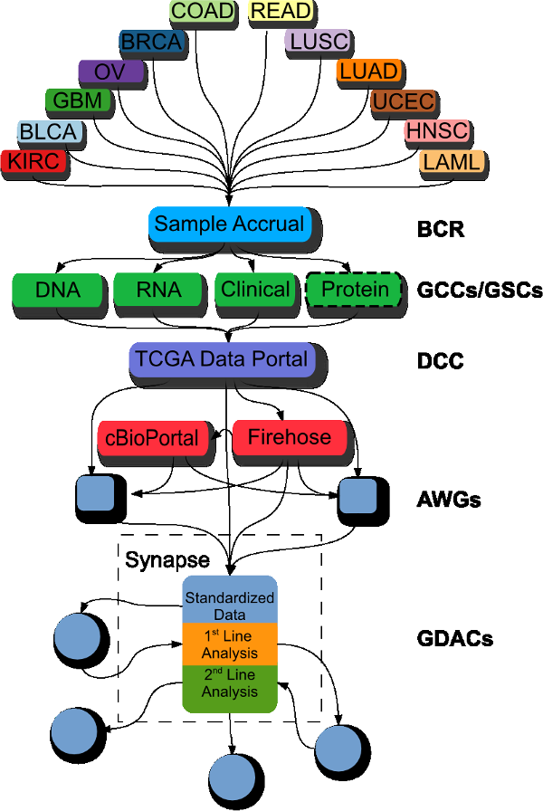
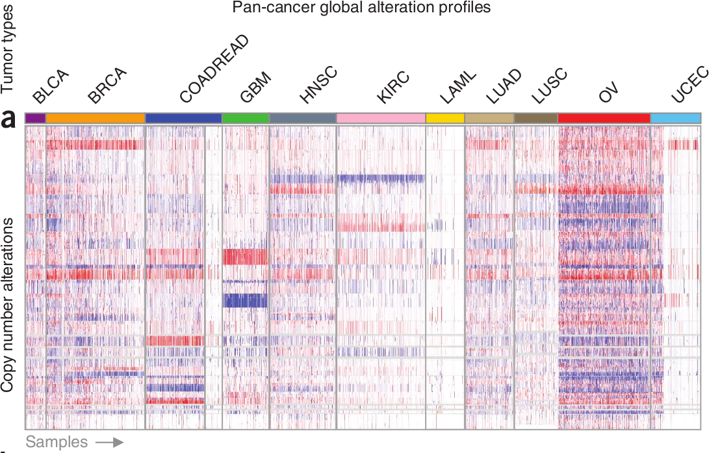

```{r loadlibs, echo=FALSE, message=FALSE, warning=FALSE, include=TRUE}
library(knitcitations)
# library(ggplot2)
# library(reshape)
# library(plyr)
# library(RColorBrewer)
library(knitr)
# library(xtable)
# library(Vennerable)
# library(gridExtra)

options(xtable.type="html", xtable.caption.placement="top", xtable.include.row.names=FALSE)
opts_chunk$set(comment=NA, echo=FALSE, warning=FALSE, message=FALSE, error=FALSE, fig.width=10, fig.height=5)

# cleanbib()
```

# Overview

## The Cancer Genome Atlas (TCGA) | Sequencing and data generation of cancer samples

<div class='centered'>

</div>

<div class="notes">
systematically explore the entire spectrum of genomic changes involved in more than 20 types of human cancer

$>$ 200 forms of cancer, and many more subtypes, caused by errors in DNA that cause cells to grow uncontrolled.

Identifying the changes in each cancer’s complete set of DNA – its genome – and understanding how such changes interact to drive the disease will lay the foundation for improving cancer prevention, early detection and treatment.

Importantly, it proved that making the data freely available would enable researchers anywhere around the world to make and validate important discoveries. The success of the pilot led the National Institutes of Health to commit major resources to TCGA to collect and characterize more than 20 additional tumor types.

Led to integrative analysis and publication of many papers detailing specific cancer types

However, that's not the only way this data can be used.

can reveal commonalities between all cancer types, shared molecular abnormalities in tumours that superficially seem distinct, and mutations that are confined to specific tumours.

This led to the creation of the Pan-cancer initiative

</div>

## The TCGA Pan-Cancer Initiative

<div class='centered'>

</div>

<div class="notes">
Put some notes here
</div>

# This paper

## Focus on TCGA Pan-Cancer Initiative | [Nature Genetics October 2013](http://www.nature.com/ng/focus/tcga/index.html)

<div class="notes">
16 initial papers integrating TCGA data across cancer types
</div>

--- 

<div class='centered'>

</div>

<div class="notes">
Put some notes here
</div>

## TL;DR { .smaller }

- Analyzed $>3000$ tumors across $12$ different cancer types
- Integrated multiple types of alterations (genomic & epigenomic)
- Used (novel?!) hierarchical stratification approach to obtain clusters of tumors
- Observed two major clusters
    - M class: primarily somatic mutation
    - C class: primarily copy number alterations 
- Inverse relationship between # of copy number alterations & # of somatic mutations (when averaged over 12 cancer types)
- Oncogenic signatures were used to derive the oncogenic pathways
- Nominated therapeutically actionable targets across tumor types

## Analyzed $>3000$ tumors | $12$ different cancer types

<div class='centered'>

</div>

## Integrated multiple types of alterations | Copy number aberrations (CNAs)

<div class='centered'>

</div>

## Integrated multiple types of alterations | Copy number aberrations (CNAs)

<div class='centered'>

</div>


## Used (novel?!) hierarchical stratification approach to obtain clusters of tumors

<div class='centered'>

</div>

## Observed two major clusters | M(utations) vs C(opy) number alterations

<div class='centered'>

</div>

## Inverse relationship b/t CNA and SNV | Cancer hyperbol[a|e]

## Oncogenic signatures were used to derive the oncogenic pathways

## Nominated therapeutically actionable targets across tumor types

## Thanks!


