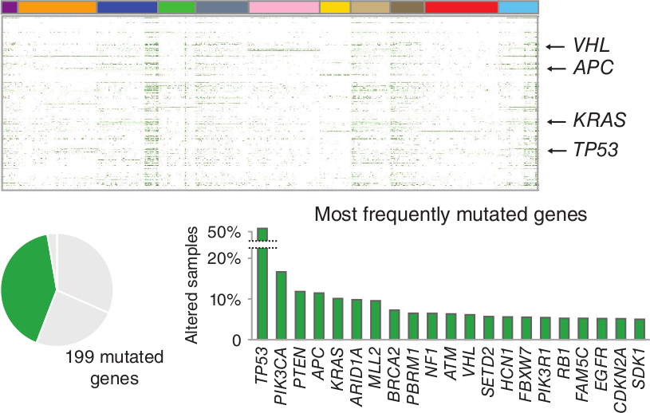
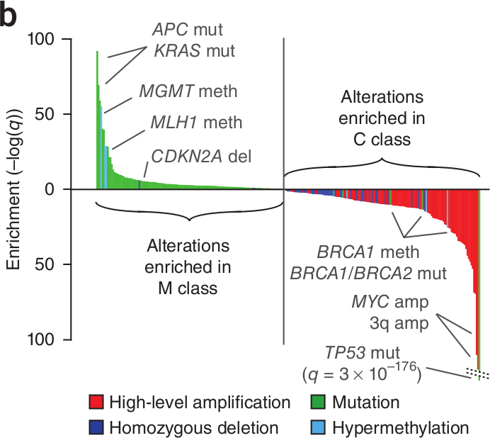
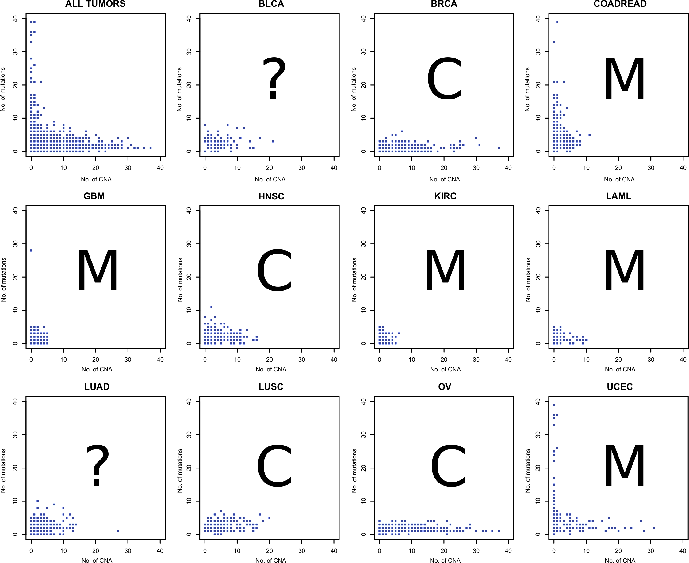
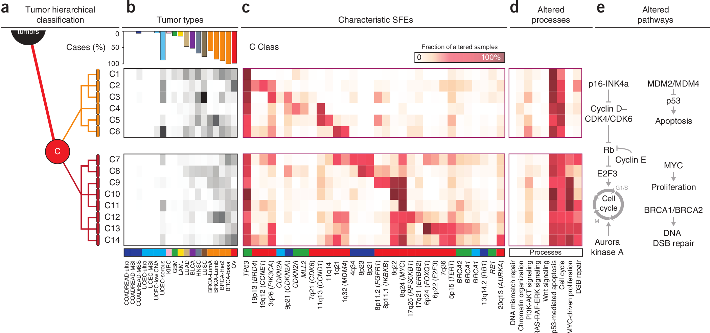

```{r loadlibs, echo=FALSE, message=FALSE, warning=FALSE, include=TRUE}
# library(knitcitations)
# library(ggplot2)
# library(reshape)
# library(plyr)
# library(RColorBrewer)
# library(knitr)
# library(xtable)
# library(Vennerable)
# library(gridExtra)

#options(xtable.type="html", xtable.caption.placement="top", xtable.include.row.names=FALSE)
# opts_chunk$set(comment=NA, echo=FALSE, warning=FALSE, message=FALSE, error=FALSE, fig.width=10, fig.height=5)

# cleanbib()
```

## The Cancer Genome Atlas (TCGA) | Assay and analyze cancer samples

<div class='centered'>

</div>

<div class="notes">
HT techniques have allowed researchers to systematically explore the entire spectrum of genomic changes in many cancer types, many individual samples

$> 200$ forms of cancer, and many more subtypes, caused by errors in DNA that cause cells to grow uncontrolled, there is a lot of space to explore to find oncogenic factors; and, in order to separate the drivers (signal) from passenger (noise) changes, a large number of samples of each tumor type is required. 

Hence the goal of the TCGA, which is performing this in more than 20 types of human cancer with sample sizes $> 1000$ for some cancer types. They are about halfway done...

Identifying the changes in each cancer’s complete set of DNA – its genome – and understanding how such changes interact to drive the disease will lay the foundation for improving cancer prevention, early detection and treatment.


However, that's not the only way this data can be used.

This led to the creation of the Pan-cancer initiative

</div>

## The TCGA Pan-Cancer Initiative

<div class='centered'>

</div>

<div class="notes">
can reveal commonalities between all cancer types, shared molecular abnormalities in tumours that superficially seem distinct, and mutations that are confined to specific tumours.

</div>

# Focus on TCGA Pan-Cancer Initiative | [Nature Genetics October 2013](http://www.nature.com/ng/focus/tcga/index.html)

<div class="notes">
16 initial papers integrating TCGA data across cancer types
</div>

## TCGA analysis | Two fundamental observations

- __Intra-cancer heterogeneity__

    > Tumors originating in the same tissue vary substantially in genomic alterations.

<br />
<br />

- Cross-cancer similarity

    > Similar patterns of genomic alteration are observed in tumors from different tissues of origin.

<div class="notes">
A number of TCGA papers focusing on both single cancer types as well as some smaller scale cross-cancer studies have identified two fundamental observations (that really were previously known aside from using HT data to do so)

These findings argue for therapeutic protocols that are based not on the tissue of origin, but on the genomic traits of the tumor observed (within reason, obviously).

</div>

--- 

<div class='centered'>

</div>

<div class="notes">
The paper under discussion today, titled "Emerging landscape of oncogenic signatures across human cancers," provides one approach for classifying individual tumors based not on their tissue of origin, but rather their selected functional events and uses data from the TCGA to do so.

</div>

## TL;DR { .smaller }

- $3299$ tumors across $12$ different cancer types
- Integrated multiple types of alterations (genomic & epigenomic)
- Hierarchical stratification approach to obtain clusters of tumors
- Observed two major clusters
    - M class: primarily somatic mutation
    - C class: primarily copy number alterations
- Inverse relationship between # of copy number alterations & # of somatic mutations (when averaged over 12 cancer types)
- Oncogenic signatures were used to derive the oncogenic pathways
- Nominated therapeutically actionable targets across tumor types

## $3299$ tumors, $12$ different cancer types | PANCAN12 dataset

<div class='centered'>

</div>

<div class="notes">
BRCA, COADREAD, UCEC (endometroid) separated into their molecular subtypes from previous studies (e.g. BRCA to ER$^+$, HER2, triple-neg/basal-like)
</div>

## Data reduction

<div class='centered'>


<br />

</div>

<div class="notes">
First, only considered recurrent (present in two or more samples)
</div>

## Integrated multiple types of alterations | Copy number aberrations (CNAs)

<div class='centered'>

</div>

## Integrated multiple types of alterations | Copy number aberrations (CNAs)

<div class='centered'>

</div>

<div class="notes">
Reduced copy number data using the algorithm GISTIC, combined with RNA-seq based expression data to only include genes affected by CNs whose expression was also altered (e.g. deletion significantly reduced expression relative to samples diploid at that position)

Frequent loss of CDK2NA, MYC, other known cancer-related genes
</div>

## Integrated multiple types of alterations | Somatic mutations (SNVs)

<div class='centered'>

</div>

## Integrated multiple types of alterations | Somatic mutations (SNVs)

<div class='centered'>

</div>

<div class="notes">
Somatic mutations were reduced using MuSiC and MutSig (determine significance of mutated genes compared to local background mutation rates)

Most freq mutation in P53 (50% of cases)
</div>

## Integrated multiple types of alterations | DNA methylation

<div class='centered'>

</div>

## Integrated multiple types of alterations | DNA methylation

<div class='centered'>

</div>

<div class="notes">
Used a previously determined panel of genes with epigenetic silencing (also filtered using RNAseq data for genes with change in mRNA levels)
</div>

## Data for further analysis | Selected functional events (SFEs)
 

<div class='centered'>

</div>

<br/>

- treated as binary variables (occured or not occured)
- network that connects samples to alterations

<div class="notes">
stratify the >3000 tumors based on the 479 selected functional events
</div>

## Bipartite network analysis | samples connected to alterations

<div class='centered'>

</div>

## Bipartite network analysis | Find optimal modules

<div class='centered'>

</div>

## Data for further analysis | Find optimal modules recursively

<div class='centered'>

</div>

## Hierarchical stratification to obtain clusters | Network modularity

<div class='centered'>

</div>

<div class="notes">
The data can be described as a mathematical structure called a bi-partite graph - nodes are samples or alterations, edges connect a sample that has a specific alteration.

The problem of clustering can then be solved as partitioning the graph into modules based on their connectivity (edges). 

This can be applied multiple times within each module to identify sub-modules, etc.

Hence, this method is essentially a type of hierarchical clustering.

For example, we have two node types here that have been partitioned into two modules, and each module has been partitioned into sub-modules.

This network is not one for tumors, but for a dataset to test that their algorithm works
from a study of "The Deep South: A Social Anthropological Study of Caste and Class"

Also tested a network of Scottish company relationships in the 20th century...

</div>

## Hierarchical stratification to obtain clusters of tumors

<div class='centered'>

</div>

## Observed two major clusters | M(utations) vs C(opy) number alterations

<div class='centered'>


</div>

<div class="notes">
certain tumor types were resoundingly characterized by a high frequency of copy number alterations (C class) (OV, BRCA, LUSC, HNSC)
or somatic mutations (S class) (KIRC, COAD, READ, GBM, LAML, UCEC)
while other tumor types showed a strong mix of both types of alterations (LUAD, BLCA).


</div>

## Features correspond to identified classes

<div class='centered'>

</div>

<div class="notes">
It's important to note that the algorithm had no idea which features were somatic mutations and which were copy number changes or methylation events.

Also, we see that p53 is an exception - it was actually the most significant feature in the C class (q = $10^{-176}$!!!!) Not sure what the kind of p-value even means...

Though, 30% of the M-class also has p53 mutations
</div>

## Inverse relationship b/t CNA and SNV | Cancer hyperbol[a|e]

<div class='centered'>

</div>

<div class="notes">
As has been described in multiple tumor subtypes previously, when evaluating individual tumors, an inverse relationship was observed between the extremes – tumors had either a large number of somatic mutations or a large number of copy number alterations but never both
</div>

## Inverse relationship b/t CNA and SNV | Cancer hyperbol[a|e]

<div class='centered'>

</div>

<div class="notes">
If we look at these individually and how they distribute based on the number of CNs and SVs, we can see a few strong signals, but a few are kind of questionable.
But in some sense, this argues for a signature approach vs a tissue approach, as some tissue types have large variation on either axis.
Importantly, there are no samples that are in the upper right of the plot - high CN AND high SNV.
</div>

## Validation PANCAN18 dataset

<div class='centered'>

</div>

## Signatures in the M class

<div class='centered'>

</div>

<div class="notes">
each subclass is defined by a core set of alterations common to those tumors (see supplemental figure 5 for details).

The M class included the majority of kidney, glioblast, AML, colo, uterine cancers; these were recursively divided into 17 subclasses.

First subclass had alterations to the PI3K-AKT pathway genes
Second subclass had alterations to APC-TP3-KRAS. 

Across the M Class alterations included mutations of ARID1A and CTCF, specifically hotspot mutations (including novel hotspot in ARID1A)

In the case of CTCF, variants were found across cancer types (predominantly breast luminbal, endometrial, and a few H&N and kidney) in subclass M5 that hit different zinc fingers, which CTCF uses for sequence selective DNA binding.
This indicates selection for zinc finger loss in this subset of samples not that is not tumor type specific


Most M sub-classes were tissue-independent (M1-M14)
However, M15-M17 were predominantly tissue-specific subsets (GBM (EGFR), LAML (NPM1), and KIRC (VHL))

</div>

## Signatures in the C class

<div class='centered'>

</div>

<div class="notes">
Key C Class alterations were initially defined by TP53 mutation recurrent CN amplification and deletions.

Included Ovarian, breast, most lung squamous, H&N, and serous UCEC.

and the absence or presence of copy number alterations on chromosome 8, which is where the MYC oncogene is located.

subclasses C3 and C4 (majority of LUSC and HNSC tumors) had strong, significant cross-cancer similarity where different alterations hit the same pathway (RB-mediated cell cycle control - loss of CDKN2A in C3 and gain of CCND1 in C4 samples)

Subclasses C7 - C14 had alterations to the cell cycle arrest and DNA damage response from multiple routes that were not tissue specific (e.g. Aurora Kinase amplification, BRCA1/BRCA2 loss, CCNE1 amp, E2F3 amp)

</div>

## Therapeutically actionable targets | Four well studied pathways across tumor types

<div class='centered'>

</div>

<div class="notes">
Many of the selected functional events are also druggable targets, either alone or in combination, so took a subset of the SFEs to focus on.
However, none of these alterations are exclusive to one tumor type nor present in 100% of samples in a particular tumor type
focusing on the ~500 selected functional events to start, this approach would reduce the complexity of initial results for an individual tumor

Looking at 4 major pathways, the majority of all samples are affected in some way by one of these, which have targets either directly or indirectly actionable with therapeutics. 

Quite a confusing figure with lots going on, so focusing across cancer types and considering signature-based types, there are also potential drug combos that can be applied. 

</div>

## Therapeutically actionable targets | across tumor types

<div class='centered'>

</div>

<div class="notes">
suggested that a tumor be classified in a tissue-independent manner, based on the genetic and epigenetic alterations present

For example, M4-M8 subgroups could be targeted in combo with PIK3A/AKT/mTOR drugs;

M15 subclass could be hit with EGFR and CDK4 inhibitors.

This is definitely only a starting place, and more samples and cancer types are needed.
</div>

## Conclusions

- Two major classes of tumors with different oncogenic drivers (mutation and copy number change)
- Argues for tissue-independent classification and treatment of tumors
- Almost all solid tumors, many other tumor types not covered
- Though the methods should get better with more data

---

<div class='centered'>

</div>

<br />
<br />

An Analysis is a new analysis of existing data (typically large genomic, transcriptomic or proteomic data sets from arrays or other high-throughput platforms) or new data obtained in a comparative analysis of technologies __that lead to novel and arresting conclusions of importance to a broad audience.__

## 

<div class='centered'>

</div>

---

<br />
<br />

<div class="centered">
<span style="font-size: 500%">Thanks!</span>
</div>

