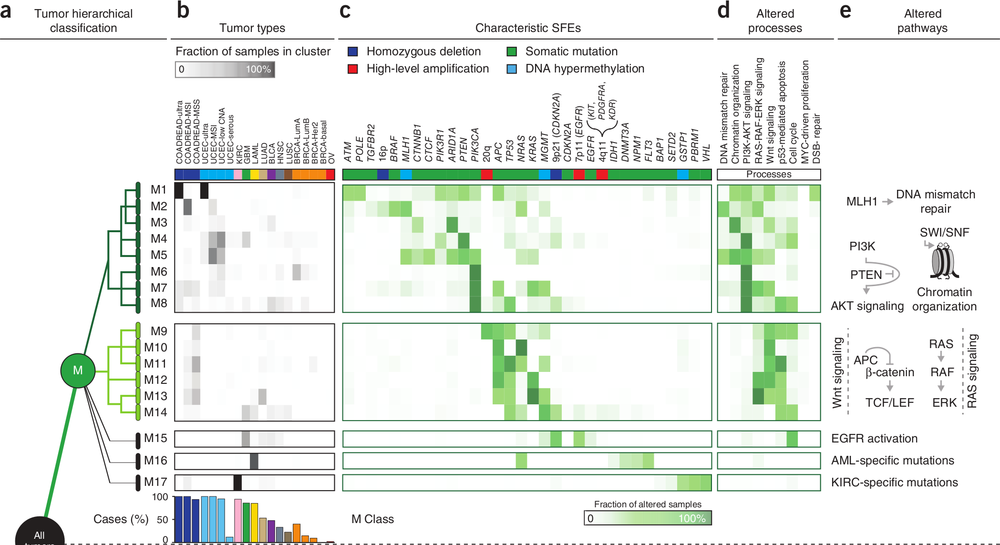

```{r loadlibs, echo=FALSE, message=FALSE, warning=FALSE, include=TRUE}
library(knitcitations)
# library(ggplot2)
# library(reshape)
# library(plyr)
# library(RColorBrewer)
library(knitr)
# library(xtable)
# library(Vennerable)
# library(gridExtra)

options(xtable.type="html", xtable.caption.placement="top", xtable.include.row.names=FALSE)
opts_chunk$set(comment=NA, echo=FALSE, warning=FALSE, message=FALSE, error=FALSE, fig.width=10, fig.height=5)

# cleanbib()
```

# The Cancer Genome Atlas and the Pan-Cancer Initiative

## The Cancer Genome Atlas (TCGA) | Sequencing and data generation of cancer samples

<div class='centered'>

</div>

<div class="notes">
$> 200$ forms of cancer, and many more subtypes, caused by errors in DNA that cause cells to grow uncontrolled.

HT techniques have allowed researchers to systematically explore the entire spectrum of genomic changes in many cancer types, many individual samples

TCGA is performing this in more than 20 types of human cancer, about halfway done

Identifying the changes in each cancer’s complete set of DNA – its genome – and understanding how such changes interact to drive the disease will lay the foundation for improving cancer prevention, early detection and treatment.

Importantly, it proved that making the data freely available would enable researchers anywhere around the world to make and validate important discoveries. The success of the pilot led the National Institutes of Health to commit major resources to TCGA to collect and characterize more than 20 additional tumor types.

Led to integrative analysis and publication of many papers detailing specific cancer types

However, that's not the only way this data can be used.

This led to the creation of the Pan-cancer initiative

</div>

## The TCGA Pan-Cancer Initiative

<div class='centered'>

</div>

<div class="notes">
can reveal commonalities between all cancer types, shared molecular abnormalities in tumours that superficially seem distinct, and mutations that are confined to specific tumours.

</div>

# Focus on TCGA Pan-Cancer Initiative | [Nature Genetics October 2013](http://www.nature.com/ng/focus/tcga/index.html)

<div class="notes">
16 initial papers integrating TCGA data across cancer types
</div>

## TCGA analysis | Two fundamental observations

- __Intra-cancer heterogeneity__

    > Tumors originating in the same tissue vary substantially in genomic alterations.

<br />
<br />

- Cross-cancer similarity

    > Similar patterns of genomic alteration are observed in tumors from different tissues of origin.

<div class="notes">
A number of TCGA papers focusing on both single cancer types as well as some smaller scale cross-cancer studies have identified two fundamental observations (that really were previously known aside from using HT data to do so)

These findings argue for therapeutic protocols that are based not on the tissue of origin, but on the genomic traits of the tumor observed (within reason, obviously).

</div>

--- 

<div class='centered'>

</div>

<div class="notes">
The paper under discussion today, titled "Emerging landscape of oncogenic signatures across human cancers," provides one approach for classifying individual tumors based not on their tissue of origin, but rather their selected functional events and uses data from the TCGA to do so.

</div>

## TL;DR { .smaller }

- $3299$ tumors across $12$ different cancer types
- Integrated multiple types of alterations (genomic & epigenomic)
- Hierarchical stratification approach to obtain clusters of tumors
- Observed two major clusters
    - M class: primarily somatic mutation
    - C class: primarily copy number alterations
- Inverse relationship between # of copy number alterations & # of somatic mutations (when averaged over 12 cancer types)
- Oncogenic signatures were used to derive the oncogenic pathways
- Nominated therapeutically actionable targets across tumor types

## $>3299$ tumors, $12$ different cancer types | PANCAN12 dataset

<div class='centered'>

</div>

<div class="notes">
BRCA, COADREAD, UCEC (endometroid) separated into their molecular subtypes from previous studies (e.g. BRCA to ER$^+$, HER2, triple-neg/basal-like)
</div>

## Data reduction

<div class='centered'>

</div>

<div class="notes">
Put some notes here
</div>

## Integrated multiple types of alterations | Copy number aberrations (CNAs)

<div class='centered'>

</div>

## Integrated multiple types of alterations | Copy number aberrations (CNAs)

<div class='centered'>

</div>

## Integrated multiple types of alterations | Somatic mutations (SNVs)

<div class='centered'>

</div>

## Integrated multiple types of alterations | Somatic mutations (SNVs)

<div class='centered'>

</div>

## Integrated multiple types of alterations | DNA methylation

<div class='centered'>

</div>

## Integrated multiple types of alterations | DNA methylation

<div class='centered'>

</div>


## Hierarchical stratification to obtain clusters of tumors

<div class='centered'>

</div>

<div class="notes">
stratify the >3000 tumors based on the 479 selected functional events
certain tumor types were resoundingly characterized by a high frequency of copy number alterations (C class) (OV, BRCA, LUSC, HNSC)
or somatic mutations (S class) (KIRC, COAD, READ, GBM, LAML, UCEC)
while other tumor types showed a strong mix of both types of alterations (LUAD, BLCA).

As has been described in multiple tumor subtypes previously, when evaluating individual tumors, an inverse relationship was observed between the extremes – tumors had either a large number of somatic mutations or a large number of copy number alterations but never both
</div>

## Hierarchical stratification to obtain clusters

<div class='centered'>

</div>

<div class="notes">
</div>

## Hierarchical stratification to obtain clusters

<div class='centered'>

</div>

<div class="notes">

</div>

## Observed two major clusters | M(utations) vs C(opy) number alterations

<div class='centered'>

</div>

## Features correspond to identified classes

<div class='centered'>

</div>

## Inverse relationship b/t CNA and SNV | Cancer hyperbol[a|e]

<div class='centered'>

</div>


## Signatures used to derive oncogenic pathways

<div class='centered'>

</div>

<div class="notes">
each subclass is defined by a core set of alterations common to those tumors (see supplemental figure 5 for details).
Key M Class alterations included mutations of ARID1A, CTCF, APC, TP53 and KRAS
Key C Class alterations were initially defined by TP53 mutation and the absence or presence of copy number alterations on chromosome 8.  

And while some subclasses were dominated by one particular tumor type, others were a mix of tumor types

</div>

## Signatures used to derive oncogenic pathways

<div class='centered'>

</div>

## Therapeutically actionable targets | across tumor types

<div class='centered'>

</div>

<div class="notes">
These clustering results have a significant clinical impact.
Many of the selected functional events are also druggable targets, either alone or in combination.
However, none of these alterations are exclusive to one tumor type nor present in 100% of samples in a particular tumor type

suggested that a tumor be classified in a tissue-independent manner, based on the genetic and epigenetic alterations present

focusing on the ~500 selected functional events to start, this approach would reduce the complexity of initial results for an individual tumor

</div>

## Data, metadata, and analyses | Synapse by Sage BioNetworks

<div class='centered'>

</div>

## Thanks!


